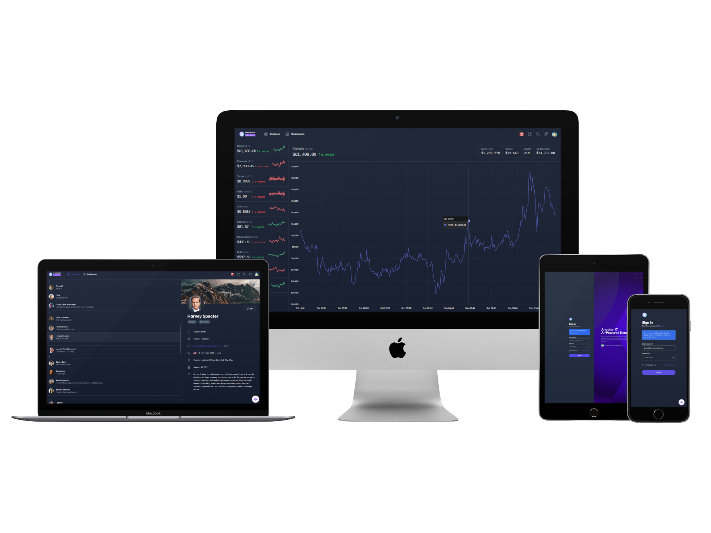

# angular-ui-demo
Angular UI Demo with built-in AI Chatbot

This is a demo application showcasing my skills in both frontend and backend development. The app utilizes Angular, Tailwind CSS, Angular Material, API integration using Firebase Cloud Functions in Node.js TypeScript, and features an AI-powered embedded chatbot connected to OpenAI.

Test drive it on this link: [https://angular.florantepascual.com/](https://angular.florantepascual.com/)

## Features

- **Contacts Manager:** Manage your contacts efficiently with a user-friendly interface.
- **Real-time Crypto-currency Graphs:** Stay updated with real-time graphs of crypto-currencies.
- **Internationalization:** Easily switch between different languages for a global audience.
- **Dark/Light Modes:** Customize your app's appearance based on your preference.
- **AI-powered Chatbot:** Interact with an intelligent chatbot powered by OpenAI.

## Technologies Used

- Angular 17
- Tailwind CSS
- Angular Material
- Firebase Cloud Functions (Node.js TypeScript)
- OpenAI (for AI-powered chatbot)
- NestJS for OpenAI Assistants API Proxy

## Note
The source code is in a private repo. Message me to arrange for a code walkthrough from [this link](https://www.florantepascual.com/book-appointment).
